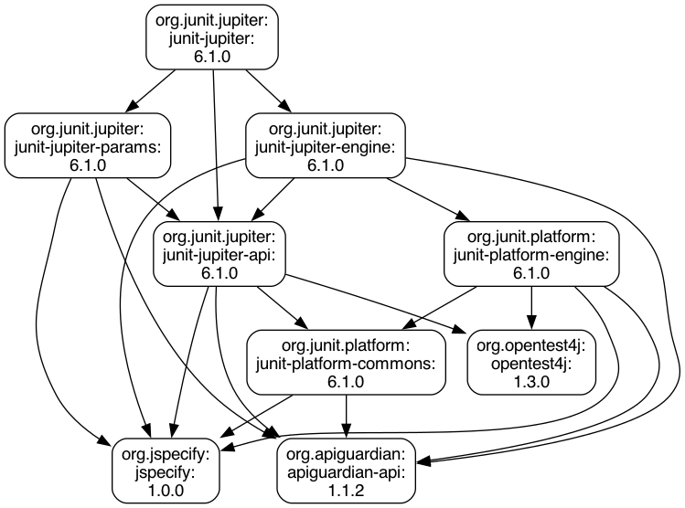

= JBang Catalog
Jason Lee
:toc: macro
:icons: font
:source-highlighter: rouge

A collection of standalone Java CLI utilities, distributed as a https://www.jbang.dev/[JBang] catalog.

toc::[]

== Getting Started

=== Prerequisites

Install JBang: https://www.jbang.dev/download/

=== Add the catalog

[source,bash]
----
jbang catalog add --name jdlee https://github.com/jdlee/jbang-catalog/blob/master/jbang-catalog.json
----

This registers the catalog locally so you can run scripts by alias.

=== Run a script

[source,bash]
----
jbang mvnsrch@jdlee --help
----

=== Install a script as a local app

JBang can install any script as a command on your `PATH`:

[source,bash]
----
jbang app install base64@jdlee
jbang app install maven-dep-graph@jdlee
jbang app install mvnsrch@jdlee
jbang app install startserver@jdlee
jbang app install modulecheck@jdlee
----

After installation, run them directly without `jbang`:

[source,bash]
----
mvnsrch -g com.google.inject
----

== base64

Encode or decode files to/from Base64.

=== Usage

[source]
----
base64 [-hvdei] [-o=<outputFile>] [<fileName>]
----

=== Options

[cols="1,3"]
|===
| Option | Description

| `<fileName>`
| The input file to process

| `-e, --encode`
| Encode the file to Base64

| `-d, --decode`
| Decode the file from Base64

| `-i, --readFromStdin`
| Read input from stdin instead of a file

| `-o, --outputFile`
| Output file path
|===

=== Examples

Encode a file:

[source,bash]
----
$ jbang base64@jdlee -e -o image.b64 photo.png
----

Decode it back:

[source,bash]
----
$ jbang base64@jdlee -d -o photo-restored.png image.b64
----

== maven-dep-graph

Build a https://graphviz.org/doc/info/lang.html[DOT] dependency graph from one or more Maven coordinates.
Fetches POM files from Maven Central (or a custom repository) and recursively walks the dependency tree.

Pipe the output through https://graphviz.org/[Graphviz] `dot` to render an image.

=== Usage

[source]
----
maven-dep-graph [-hv] -a=<artifacts> [-r=<repository>] [-o=<outputFile>]
----

=== Options

[cols="1,3"]
|===
| Option | Description

| `-a, --artifact`
| Maven coordinates in `groupId:artifactId:version` format (required, repeatable)

| `-r, --repository`
| Maven repository URL (default: `https://repo1.maven.org/maven2`)

| `-o, --outputFile`
| Write output to a file instead of stdout. The format of the file will be determined by the extension. Supported formats: png, svg, dot
|===

=== Examples

Generate a dependency graph for JUnit Jupiter and render it as a PNG:

[source,bash]
----
$ jbang maven-dep-graph@jdlee -a org.junit.jupiter:junit-jupiter:6.1.0 -o junit-dep-graph.png
----

.Dependency graph for `org.junit.jupiter:junit-jupiter:6.1.0`

Write the DOT file to disk for later processing:

[source,bash]
----
$ jbang maven-dep-graph@jdlee -a org.junit.jupiter:junit-jupiter:6.1.0 -o deps.dot
$ dot -Tsvg deps.dot -o deps.svg
----

Use a custom repository:

[source,bash]
----
$ jbang maven-dep-graph@jdlee -a com.example:my-lib:1.0.0 -r https://my-nexus.example.com/repository/maven-public
----

== mvnsrch

Search https://central.sonatype.com/[Maven Central] from the command line using the Sonatype REST API.

=== Usage

[source]
----
mvnsrch [-hvd] [--ga=<ga>] [-c=<classname>] [-f=<fc>] [-g=<group>]
        [-a=<artifact>] [-r=<rows>] [-s=<sort>]
----

=== Options

[cols="1,3"]
|===
| Option | Description

| `--ga=<group:artifact>`
| Search by group and artifact together

| `-g, --group`
| Search by group ID

| `-a, --artifact`
| Search by artifact ID

| `-c, --classname`
| Search by simple class name

| `-f, --fc, --fqcn`
| Search by fully-qualified class name

| `-r, --rows`
| Number of rows to return (default: 20)

| `-s, --sort`
| Sort by: `(a)rtifact`, `(g)roup`, `(i)d`, `(v)ersion`, `(d)ate`

| `-d, --descending`
| Sort results in descending order
|===

=== Examples

Search by group ID:

[source,bash]
----
$ jbang mvnsrch@jdlee -g com.google.inject
Coordinates                               Last Updated
===========                               ============
com.google.inject:guice-bom:5.1.0         2022-01-24 04:05 PM (CST)
com.google.inject:guice-bom:6.0.0         2023-05-12 12:30 PM (CDT)
com.google.inject:guice:5.1.0             2022-01-24 04:06 PM (CST)
com.google.inject:guice:7.0.0             2023-05-12 12:41 PM (CDT)
...
----

Search by group and artifact:

[source,bash]
----
$ jbang mvnsrch@jdlee --ga com.google.inject:guice
----

Search by fully qualified class name:

[source,bash]
----
$ jbang mvnsrch@jdlee -f org.junit.Test
----

Limit results and sort by version descending:

[source,bash]
----
$ jbang mvnsrch@jdlee -g org.apache.commons -r 5 -s v -d
----

== startserver

Manage starting a https://www.wildfly.org/[WildFly] / https://www.redhat.com/en/technologies/jboss-middleware/application-platform[JBoss EAP] server with optional CLI configuration applied before startup.

The script auto-discovers the server distribution under `build/target/` or `dist/target/`, extracts it from a zip if needed, configures JPDA debug, and runs `jboss-cli` commands before starting the server.

=== Usage

[source]
----
startserver [-hvcLOMmfsSn] [--ha] [--file=<file>] <serverDir>
----

=== Options

[cols="1,3"]
|===
| Option | Description

| `<serverDir>`
| Path to the server directory (auto-detected if omitted)

| `-c, --clean`
| Clean and rebuild the server before starting

| `-L, --logging`
| Set logging level to DEBUG

| `-O, --otel, --opentelemetry`
| Enable OpenTelemetry

| `-M, --micrometer`
| Enable Micrometer with Prometheus registry

| `-m, --microprofile`
| Use the `standalone-microprofile.xml` configuration

| `-f, --full`
| Use the `standalone-full.xml` configuration

| `--ha`
| Use the `standalone-full-ha.xml` configuration

| `-s, --suspend`
| Suspend on start for debugger attachment

| `-S, --secman`
| Enable security manager

| `-n, --dry-run`
| Configure but don't start the server

| `--file=<file>`
| Load additional CLI commands from a file
|===

=== Examples

Start the server with auto-detection:

[source,bash]
----
$ jbang startserver@jdlee
----

Start with OpenTelemetry and debug logging:

[source,bash]
----
$ jbang startserver@jdlee -O -L
----

Start with the MicroProfile configuration, suspended for debugging:

[source,bash]
----
$ jbang startserver@jdlee -m -s
----

Dry run to see what would be configured:

[source,bash]
----
$ jbang startserver@jdlee -O -M -n
----

Apply extra CLI commands from a file:

[source,bash]
----
$ jbang startserver@jdlee --file=my-commands.cli
----

== modulecheck

Identify potentially unnecessary JARs in https://www.wildfly.org/[WildFly] / JBoss EAP module definitions.
For each `<resource-root>` or `<artifact>` entry in every `module.xml` found under the module directories, the script temporarily removes it and runs a user-supplied test script.
If the tests still pass, the entry is flagged as potentially unnecessary.

Results are written to `./modulecheck-results/`.

=== Usage

[source]
----
modulecheck [-hv] --wildfly-dir=<dir> --script=<script> [--module-dir=<dir>]
----

=== Options

[cols="1,3"]
|===
| Option | Description

| `--wildfly-dir`
| Path to the WildFly installation to modify and test (required)

| `-s, --script`
| Script to run to test each artifact (required)

| `--module-dir`
| Module directory relative to `--wildfly-dir` (repeatable; default: `modules`)

| `-v, --verbose`
| Show script output as it runs
|===

=== Examples

Test all modules under the default `modules` directory:

[source,bash]
----
$ jbang modulecheck@jdlee --wildfly-dir=/opt/wildfly --script=./run-tests.sh
----

Test with custom module directories and verbose output:

[source,bash]
----
$ jbang modulecheck@jdlee --wildfly-dir=/opt/wildfly --module-dir=modules --module-dir=extra-modules --script=./run-tests.sh -v
----
